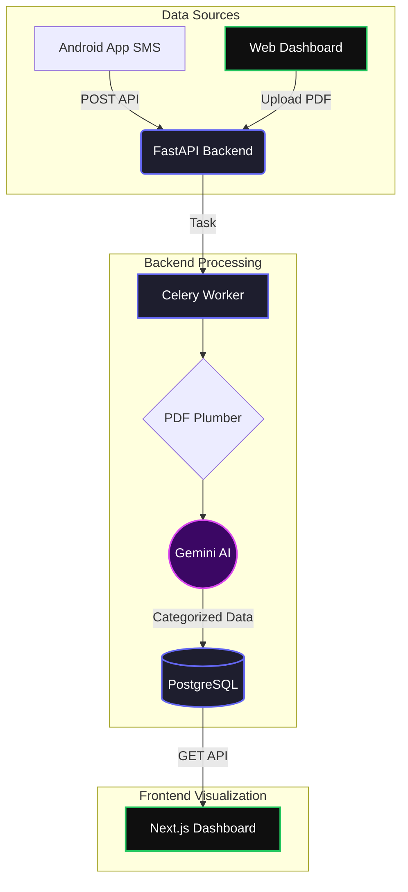

<div align="center">
  
  <h1 align="center">Fynlo 💸</h1>
  <p align="center">
    <strong>A production-ready UPI expense tracking and AI-powered money management application.</strong>
  </p>

  <p align="center">
    
    
    
    
    
    
    
  </p>
</div>

<br />

## 🌟 Overview
Fynlo automatically tracks your expenses from multiple sources to give you a unified, beautifully visualized dashboard of your cash flow. It eliminates the hassle of manual entry by securely parsing your bank statements and SMS notifications, powered by **Google's Gemini 1.5 Flash AI**.

## 🚀 Key Features
- **✨ AI-Powered Categorization:** Upload bank statements (PDF/CSV) and watch as Gemini AI seamlessly categorizes each transaction.
- **📱 Background SMS Sync:** Companion Android app built in Kotlin automatically syncs your UPI transactions locally to the backend.
- **⚡ Asynchronous Processing:** Heavy file parsing and AI model batching handled gracefully by **Celery & Redis**.
- **📊 Aesthetic Dashboard:** Visualize your spending limits, recent transactions, and cash flow trends with **Next.js & Recharts**.
- **🛡️ Secure & Scalable:** JWT Authentication, optimized Postgres queries, and fully Dockerized microservices.

---

## 🏗️ Architecture & Workflows



### Flow Breakdown:
1. **SMS Sync:** The Kotlin Android App uses a `BroadcastReceiver` to detect UPI SMS. It queues an upload task via `WorkManager` to silently sync the transaction to the backend API.
2. **PDF Statement Processing:** The user uploads a bank statement. The API immediately responds with a success status, while a **Celery** background worker begins executing the `process_statement_task`.
3. **AI Categorization Pipeline:** The worker extracts tabular data, batches up to 20 transactions at a time, and passes them to the **Gemini AI** for intelligent categorization (e.g., Zomato → Food).
4. **Data Delivery:** The **Next.js** frontend makes authorized API calls to retrieve the enriched, categorized data, plotting it on the beautiful dashboard.

---

## 💻 Tech Stack Breakdown
| Domain | Technologies Used |
|---|---|
| **Backend API** | FastAPI, Python 3.11+, Pydantic v2, JWT (python-jose) |
| **Database & ORM** | PostgreSQL, SQLAlchemy, Alembic Migrations |
| **Task Queue** | Celery, Redis |
| **AI / NLP** | Google Generative AI (Gemini 1.5 Flash API), pdfplumber |
| **Frontend UI** | Next.js 15 (App Router), Tailwind CSS, shadcn/ui, Recharts, Zustand |
| **Mobile App** | Kotlin, Room DB, WorkManager, OkHttp, Clean Architecture |
| **Infrastructure** | Docker, Docker Compose |

---

## ⚙️ Local Development Setup

### Prerequisites
- Docker and Docker Compose
- Node.js (v18+)
- A **Google Gemini API Key**

### 1. Start the Backend Infrastructure
The database (PostgreSQL), cache (Redis), FastAPI Backend, and Celery workers all run seamlessly in Docker.
```bash
# Start all backend containers
docker-compose up -d --build
```
> The backend API will be available at `http://localhost:8000`. <br/>
> View the interactive Swagger API documentation at: **[http://localhost:8000/docs](http://localhost:8000/docs)**

### 2. Start the Frontend
The Next.js frontend connects directly to the FastAPI backend.
```bash
cd frontend
npm install
npm run dev
```
> The beautifully styled dashboard will be available at **[http://localhost:3000](http://localhost:3000)**.

### 3. Android App
The Android app is located in the `android/` directory. You can open this directory in Android Studio, build the APK, and install it on your device to test the live SMS syncing functionality!

---

<div align="center">
  <i>Built with ❤️ for elegant, intelligent money management.</i>
</div>
